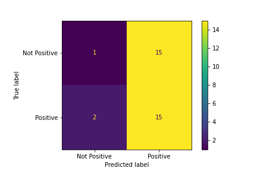
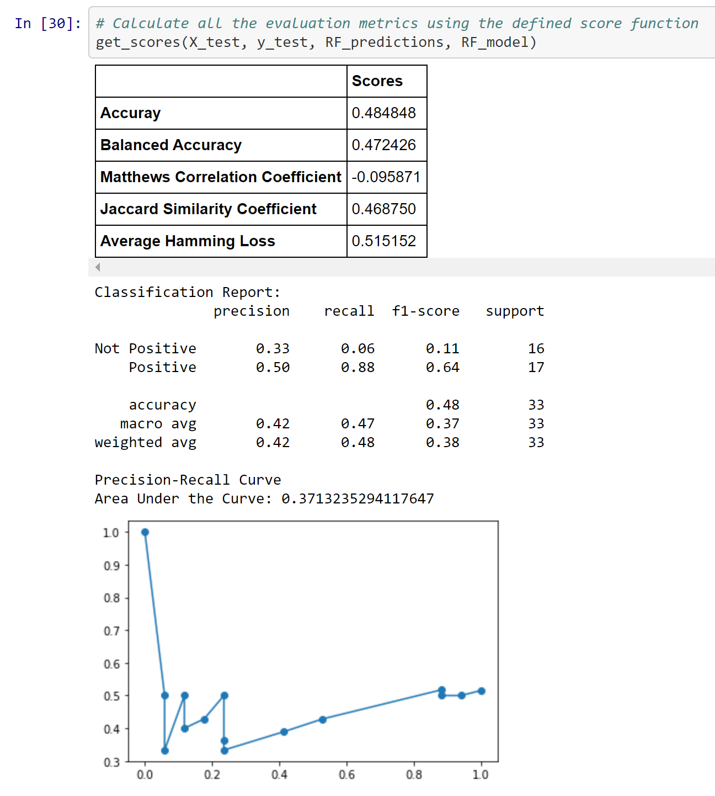
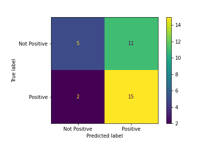
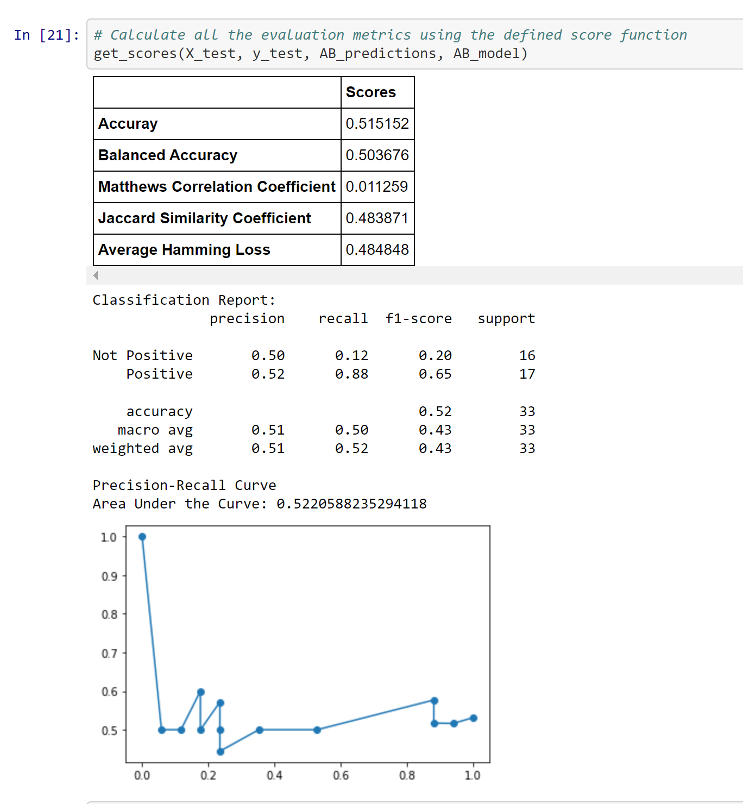

# Project 2 
# Easy Coin Investing
## Team Members
Justin Bernier, Monique Ticzon, Tony Hart, Max Larsen

## Core Message
Create crypto currency investing recommendations by using the better performing machine learning model (Random Forest classifier vs. AdaBoost classifier) and predicting performance with technical and sentiment signals.

## Objectives/Questions to Answer
1. Which model performs better?
2. Identify most useful metrics.
3. Create an all-in-one dashboard to display key investing information.

## Key Files
* Justin/kraken_pull.ipynb - API call to Kraken to pull in crypto OCHLV data.  Dashboard is generated in this file too. 
* Justin/kraken_pull*.csv files - example pulls of ETH trade data in .csv format.
* Max/crypto_sentiment_data_pull
* Monique/ML_models_technical_sentiment.ipynb (Technical + Sentiment Signals)
* Monique/ML_models_sentiment.ipynb (Sentiment Signal)
* Monique/ML_models_technical.ipynb (Technical Signals)

## Usage Instructions
1. Choose the cryptocurrency you want to look at and at what time interval.
2. Run the function to pull the technical signals and sentiment signals datasets.
3. Load the AdaBoost Classifier/Random Forest Classifier model.
4. Fit the model to the dataset.
5. Run the evaluation metrics functions to see performance results.
6. Run the dashboard to display the key investing information.
## Predictive Models
Chose to compare two ensemble learning methods: AdaBoost and Random Forest. The two are slightly different from each other in making predictions.
* Random Forest
    *  Based on bagging technique using a bunch of decision trees
    * Decision trees use different variables or features
    * Equally-weighted decision trees
* AdaBoost
    * Based on boosting technique using a bunch of decision stumps
    * Decision stumps are decision trees with one node and two leaves
    * Variably-weighted decision stumps
    * The order in which decision stumps are created is important
    * Used Decision Tree Classifier to make results comparable
## Data Sources and Preparation
Exploration and Cleanup Process: 
* Pulling data from Kraken was relatively straightforward except for getting the date timestamp into a readable format.  It took quite awhile to realize it was stored in milliseconds UNIX. 
* Cleanup processes used were to remove null values, convert the date and make it an index, prepare technical indicators and shift the data appropriately when looking at daily returns.  

Unanticipated Data Preparation Problems:
* Null data affected the scaling of the data.
* Limitations in using the Crypto News API - we could only go back to December 1st 2020 for the crypto news data that was used to derive sentiment. 

## Model Training
* Training and testing of different sets of features - (1) technical signals, (2) sentiment signals, and (3) technical and sentiment signals combined.
* Use of Google Colab expedited the model training process.
* Issues with training related to finding data that needed to be cleaned up.
* Understanding the parameters and evaluation metrics results for each model and ensuring they are comparable.
* Model tuning parameters did not seem to make much difference in evaluation metrics other than changes in max_depth - increasing it resulted in noticeably lower performance when evaluating technical and sentiment signals separately, but was better when combined.
## Model Evaluation
Looked at the accuracy score, balanced accuracy score, Matthews Correlation coefficient (quality of binary classification, between -1 and 1), Jaccard similarity coefficient (gauges similarity and diversity in sample sets), average Hamming loss (fraction of labels that are incorrectly predicted), confusion matrix, classification report, and precision-recall curve to evaluate model performance.

* Random Forest Classifier
    * Technical Signals and Sentiment Signal on their own - better overall and extremely well on the recall score for the Positive class.
    * Technical and Sentiment Signals Combined - did not perform as well overall in comparison to the AdaBoost Classifier. (The below metrics represent the combined signals.)

* AdaBoost Classifier
    * Technical Signals and Sentiment Signal on their own - did not perform as well overall in comparison to the Random Forest Classifier.
    * Technical and Sentiment Signals Combined - performed better overall in comparison to the Random Forest Classifier. (The below metrics represent the combined signals.)

## Predictions and Conclusions
* Random Forest performed better overall and extremely well in recall score (true positive rate) for the Positive class when signals were not combined.
* Feature importances variably-weighted with the AdaBoost Classifier results in better performance when running technical and sentiment signals combined.
* The models performed well when evaluating the recall score (true positive rate) for the Positive class.
* Cryptocurrency is highly volatile and could be one reason behind the low accuracy scores.
## Postmortem
* Difficulties encountered:
    * Pulling data for sentiment analysis from Crypto News API.
    * Fundamental analysis does not seem feasible/practical for cryptocurrency.  
    * Generating a comprehensive dashboard took longer than expected and we reviewed several platforms to accomplish this task.  Ideally we would have hosted a Flask/Heroku app hosted on a web portal that we pushed our sentiment results, technical indicators, and model results - but we found this more complicated than anticipated and the other dashboard approaches we reviewed didn’t meet our requirements.  Ultimately, we chose Plotly Dash and were able to get it up and running - future improvements would be to streamline dashboard generation and create more KPI like features.   
* Unanswered additional questions/problems:
    * Applying Named-entity recognition in sentiment analysis and see how that affects our predictive models.
    * Experiment on ways to improve accuracy scores for both models.
---
## Initial Proposal - Superseded
## Project Description
    Create crypto currency recommendations by using machine learning modeling and predict performance

    Use Google Colab and scikit learn

## Objectives / Project Questions to Answer
    -Which model performs better
    -What is our ROI?
    -Identify most useful metrics
    -Create a all-in-one dashboard

## Data Sources
    Kraken API
    CryptoQuant
    Technical Analysis API

## Rough Breakdown of Tasks
    Project Manager - Monique
    Machine Learning Models - Team
    Data Analysis/Exploration - Team
    Technical Analysis Research - Team  
